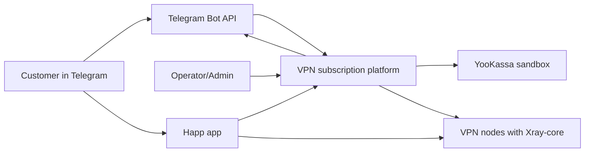
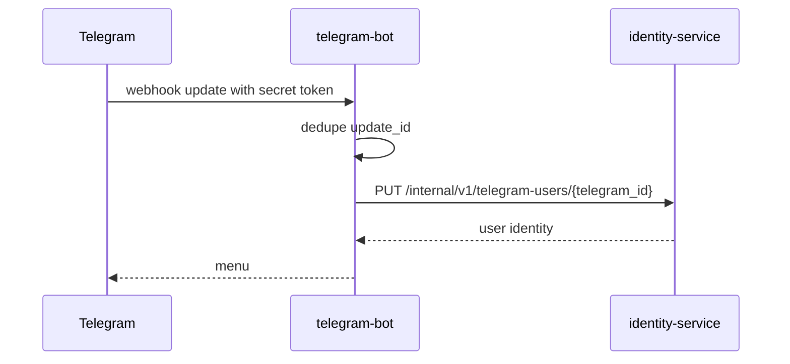
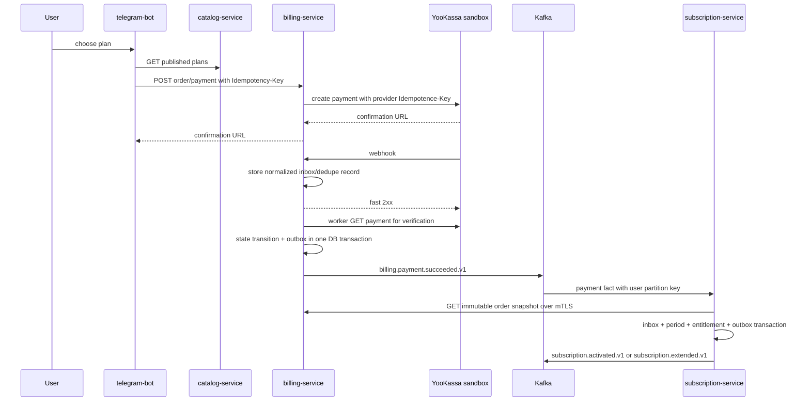
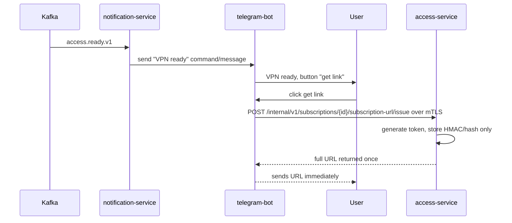
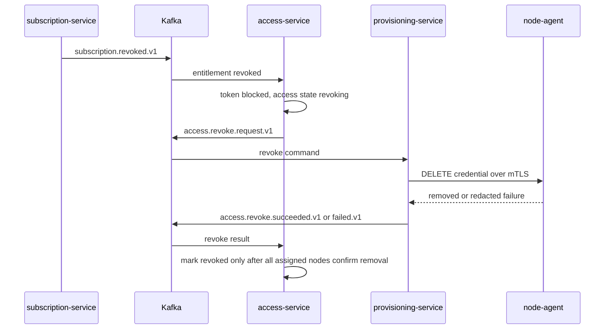

# Architecture

## Purpose

The platform sells prepaid VPN subscription periods through a Telegram bot, confirms payment through YooKassa sandbox in the first version, provisions VLESS + REALITY credentials to Xray-core nodes through a control plane and node-agent, then issues a secret Happ-compatible subscription URL through a one-time synchronous flow.

Happ is only the user client. It is not the VPN provider. User VPN traffic must pass through owned or rented Xray-core nodes.

## Current Scope

Stage 4 implements onboarding, the sandbox purchase boundary, and subscription entitlement lifecycle. `identity-service`, `catalog-service`, `billing-service`, `subscription-service`, and `telegram-bot` run locally with separate logical PostgreSQL databases. Subscription consumes verified payment facts through its own inbox, validates immutable terms through Billing's allowlisted mTLS order API, owns paid periods, and publishes activation, extension, expiry, and revocation facts through its outbox.

The current environment is portfolio/sandbox only. It does not use real YooKassa credentials, issue receipts, initiate provider refunds, create VPN credentials, issue Happ URLs, or touch Xray-core. Active entitlement explicitly does not mean VPN access is ready.

## Product Decisions Already Accepted

- Portfolio/sandbox project only. No real sales until legal review.
- One prepaid 30-day MVP plan seeded by configuration.
- No hard traffic cap in v1.
- One selected region, one primary node, and one failover node.
- Grace period is 24 hours.
- Buying while active extends from `current_period_end`; buying after expiry starts from confirmed payment time.
- Only full operator-initiated refunds in v1.
- Confirmed full refund is tied to the specific payment-funded subscription period; it revokes current access when recalculation creates a gap, while historical or future-only refunds preserve currently valid access.
- Happ HWID and device limit are not used in v1.
- Only aggregate traffic and health data may be collected.
- Management plane uses private WireGuard networking and mTLS.
- Admin surface is protected CLI plus internal admin API with RBAC and audit. No web-admin in v1.
- Capacity reserve is at least 20%; no new users are assigned when a node reaches 80% of configured capacity.

See `docs/product-decisions.md` for the full decision log.

## System Context



## Containers and Services

| Component | Responsibility | Owns durable data |
|---|---|---|
| `edge` | TLS, routing, coarse rate limits, security headers, access log redaction | No |
| `telegram-bot` | Telegram webhook ingestion, UX, FSM, user commands | No durable domain state |
| `identity-service` | Telegram identity, users, consent, blocking, roles | Yes |
| `catalog-service` | Plans, prices, locations, published catalog | Yes |
| `billing-service` | Orders, YooKassa sandbox payments, refunds, webhook inbox, payment outbox | Yes |
| `subscription-service` | Entitlement lifecycle, periods, expiry, revocation | Yes |
| `access-service` | Subscription URL tokens, Happ document rendering, credential lifecycle | Yes |
| `provisioning-service` | Nodes, allocations, desired state, operations, health snapshots | Yes |
| `notification-service` | Durable Telegram notifications and retry | Yes |
| `node-agent` | Applies Xray desired state on a VPN node, validates config, reports aggregate health | Local last-known-good and operation journal |
| `Xray-core` | Data-plane VPN traffic processing | Local config/state only |

## Corrected Repository Layout

The original specification showed a root `cmd/` next to `services/<service>/internal/`. That conflicts with Go `internal` import rules because root command packages cannot import sibling service internals.

Use this layout instead:

```text
.
├── AGENTS.md
├── PLANS.md
├── go.mod
├── internal/
│   └── platform/
│       ├── config/
│       ├── logging/
│       ├── httpserver/
│       ├── postgres/
│       ├── kafka/
│       ├── outbox/
│       ├── observability/
│       └── cryptoutil/
├── services/
│   ├── identity/
│   │   ├── cmd/
│   │   │   └── identity-service/
│   │   │       └── main.go
│   │   ├── internal/
│   │   │   ├── domain/
│   │   │   ├── application/
│   │   │   ├── repository/
│   │   │   └── transport/
│   │   ├── migrations/
│   │   ├── openapi/
│   │   └── Dockerfile
│   └── ...
├── contracts/
│   ├── http/
│   └── events/
├── deploy/
├── docs/
└── scripts/
```

For the first version use one root `go.mod`. Service boundaries are enforced by folder ownership, Go `internal`, architecture tests, CI checks, and code review. `go.work` and per-service modules are deferred until there is a concrete need.

Root `internal/platform` may contain technical helpers only. It must not define `User`, `Payment`, `Subscription`, `Credential`, plan models, or other cross-service domain entities.

## Communication Model

| Interaction | Mechanism | Rule |
|---|---|---|
| Immediate command/query | HTTP/JSON over `net/http` | Use when caller needs a direct response |
| Domain fact | Kafka event with outbox/inbox | Past-tense event, at-least-once, idempotent consumer |
| Async command | Kafka command message | Explicit owner, timeout, retry, DLQ, terminal failure |
| Credential material retrieval | HTTP/mTLS | Provisioning-service fetches minimum material from access-service by credential ID |
| Node desired state | HTTPS/mTLS over private WireGuard network | Idempotent operation ID and desired revision |
| Public subscription document | `GET /s/{token}` on separate hostname | Bearer token in path, redacted everywhere, no-store |

Kafka never replaces HTTP when an immediate answer is required. PostgreSQL commit and Kafka publish are connected through transactional outbox, not a distributed transaction.

## Kafka Naming

- Domain facts use past tense: `billing.payment.succeeded.v1`.
- Async commands use imperative command naming: `access.provision.request.v1`.
- Command result facts use past tense: `access.provision.succeeded.v1`, `access.provision.failed.v1`.
- Revoke result facts are explicit: `access.revoke.succeeded.v1`, `access.revoke.failed.v1`.
- User-delivery readiness is separate: `access.ready.v1`.
- Every message uses the common envelope with `event_id`, `schema_version`, `producer`, `correlation_id`, `aggregate_type`, `aggregate_id`, and a stable `partition_key`.
- Events and commands are documented in AsyncAPI and JSON Schema.
- Partition keys are exact per message family: billing/subscription/user-delivery events use `user:{user_id}`, credential operation commands/results use `credential:{credential_id}`.

## Data Ownership

Each service owns its database or schema, DB user, migrations, and data model. A local Compose environment may use one PostgreSQL instance, but services must use separate logical databases or schemas and separate credentials. Cross-schema joins and direct cross-service SQL are forbidden.

Redis is only for ephemeral FSM, cache, rate limits, and short locks. It is never a source of truth.

## Primary User Flows

### Registration



### Purchase and Payment Confirmation



The existing payment event remains v1-compatible and intentionally carries no mutable catalog lookup. Subscription validates event identity, plan, and money against the immutable Billing order snapshot before committing the Kafka offset. Duplicate event IDs and duplicate source payment IDs cannot create another period.

### Entitlement Time Lifecycle

- A purchase while active or in grace appends a complete period at the current entitlement end.
- A purchase after expiry or revocation starts at provider-confirmed `paid_at`.
- At `current_period_end`, active becomes grace. At `grace_ends_at`, active/grace becomes expired and emits one event.
- Scheduler rows use recoverable leases and `FOR UPDATE SKIP LOCKED`; exact boundaries use `now >= boundary` semantics.
- A confirmed full refund marks only its immutable source period and recalculates remaining paid periods. It emits terminal revoke when nothing remains, refund-gap revoke when only a future period remains, and no revoke for historical or future-only changes while current access remains valid.
- Refund-before-payment is retained as normalized pending inbox work and reconciled after the source period arrives.

### Access and Provisioning

```mermaid
sequenceDiagram
    participant Kafka
    participant Sub as subscription-service
    participant Access as access-service
    participant Prov as provisioning-service
    participant Agent as node-agent
    participant Xray
    Kafka->>Sub: billing.payment.succeeded.v1
    Sub->>Kafka: subscription.activated.v1 or subscription.extended.v1
    Kafka->>Access: subscription event
    Access->>Access: create credential only; no subscription token yet
    Access->>Kafka: access.provision.request.v1
    Kafka->>Prov: provision command
    Prov->>Access: GET credential material over mTLS
    Access-->>Prov: minimum VLESS material; no REALITY private key
    Prov->>Agent: PUT credential over mTLS
    Agent->>Xray: validate, atomic apply, reload
    Agent-->>Prov: operation result
    Prov->>Kafka: access.provision.succeeded.v1 or failed.v1
    Kafka->>Access: provisioning result
    Access->>Kafka: access.ready.v1 when primary node applied
```

Subscription entitlement can be `active` while VPN access is still pending. VPN access becomes `ready` only after the primary node successfully applies the credential. If failover is not ready, provisioning is `degraded`, access may be issued through the one-time link flow, and the failure must be visible in metrics, admin CLI, and alerting. If the primary node fails, access must not become `ready`.

### One-Time Subscription URL Issuance



The plaintext subscription token is never created before provisioning and is never sent through Kafka. The bot must not persist or log the returned URL.

### Revoke Lifecycle



Reconciliation periodically compares access state, provisioning allocations, and node actual state. Terminal revoke failure creates alert and operator escalation.

## Subscription Endpoint

`GET /s/{token}` is served from a dedicated subscription hostname by `access-service`.

Initial ADR decision:

- Unknown, expired, and revoked tokens return the same external response.
- Response does not reveal user or subscription existence.
- Use `404 Not Found`, `Content-Type: text/plain; charset=utf-8`, `Cache-Control: no-store`.
- Response body is generic and contains no token, user ID, credential ID, or reason.
- Edge, reverse proxy, traces, metrics, and error reporting must not record the path segment.
- Stage 5 must run Happ compatibility tests against the current official documentation and may supersede the status/body decision through a new ADR if needed.

## Security Boundaries

| Boundary | Required control |
|---|---|
| Public Telegram webhook | TLS, Telegram secret token header, body limit, dedupe, no raw payload logs |
| Public YooKassa webhook | TLS, body limit, inbox dedupe, fast durable store, async provider verification before fulfillment |
| Public subscription URL | Dedicated hostname, no-store, token hash lookup, path redaction, rate limit |
| Internal service APIs | mTLS service identity from platform CA; private network is defense in depth |
| Provisioning material API | mTLS restricted to provisioning-service; audit; no REALITY private key |
| Admin operations | CLI/internal API over admin mTLS, RBAC, deny-by-default, audit log |
| Management plane | Private WireGuard network, mTLS, firewall default deny |
| Node agent | Allowlisted fields only, no shell command execution, Xray config test before reload |

## HTTP Authentication Model

- Internal service APIs require mTLS and per-endpoint service identity allowlists.
- Admin APIs require admin mTLS identity, RBAC, and audit.
- Telegram webhook requires `X-Telegram-Bot-Api-Secret-Token`.
- YooKassa webhook is public ingress; trust is established by storing the notification and verifying provider state through YooKassa API before fulfillment.
- Published plans are public and use `security: []`.
- `GET /s/{token}` is public bearer-by-URL for Happ compatibility and uses path redaction everywhere.

## Observability

Metrics must be useful without exposing secrets or high-cardinality identifiers. Labels must not contain user IDs, payment IDs, subscription tokens, VLESS UUIDs, raw paths, destination IPs, or Telegram payload data.

Initial SLOs come from the specification:

- Control API availability: 99.9% monthly.
- Subscription endpoint availability: 99.95% monthly.
- p95 simple internal HTTP requests: under 300 ms without external provider.
- p95 subscription document: under 200 ms with warm DB.
- 99% of successful payment events start provisioning within 60 seconds.

## Deferred Production Risks

The architecture intentionally keeps several decisions as future approval points:

- Production jurisdiction and legal compliance.
- Real YooKassa receipts, tax fields, and buyer data.
- Actual domain, DNS/TLS, and VPS provider choices.
- Happ compatibility details beyond Stage 0 documentation.
- Xray-core pinned version and security review.
- Production admin credential issuance and rotation procedure.
