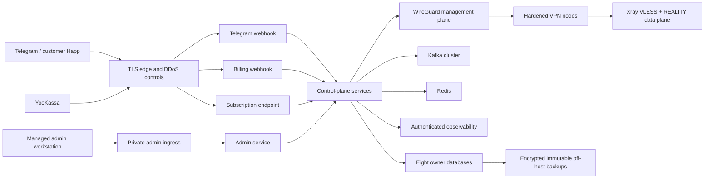

# Stage 9 Production Topology Readiness

Review date: 2026-08-02
Review owner: Platform / Operations / Security
Status: **NO-GO; provider-neutral contracts implemented, no provider selected**
Scope: design review only; no production resource, DNS record, credential,
registry artifact, database, or VPS was created

## Required logical topology

The first production milestone remains Docker/systemd or an equivalent
provider-supported host scheduler. Kubernetes is not selected and must not be
introduced without a separate capacity, operations, and cost justification.

## Provider-neutral options

| Capability | Option A | Option B | Trade-off and decision rule | Status |
|---|---|---|---|---|
| DNS/TLS edge | managed authoritative DNS, certificates, DDoS/WAF | self-managed authoritative DNS and reverse proxies | managed service reduces operational load; self-managed increases custody/control and on-call burden | blocked |
| Control plane | at least two hosts behind approved edge | provider-managed container service without Kubernetes | host model matches current artifacts; managed service must support digest deploy, private networks, mounts, health and rollback | blocked |
| PostgreSQL | managed HA with PITR and isolated restore | self-managed primary/standby plus WAL archive | managed reduces DBA burden; either choice must prove failover, role isolation, RPO/RTO and exportability | blocked |
| Kafka | managed multi-AZ quorum | self-managed minimum production quorum | managed reduces broker operations; either choice needs per-service ACL, replay, capacity and outage evidence | blocked |
| Redis | managed TLS/auth replica/failover | self-managed private instance with tested recovery | Redis is ephemeral, but outage behavior and license/terms still require approval | blocked |
| Secret manager | cloud/provider secret manager | dedicated Vault-compatible service | managed integrates IAM; dedicated service increases control and operating burden; both require audit, rotation, recovery and environment isolation | blocked |
| PKI | managed private CA plus offline trust anchor | dedicated CA with HSM-backed issuing keys | exact SPIFFE identities, short leaves, revocation, emergency disable and audit are mandatory | blocked |
| Registry | managed OCI registry | self-hosted OCI registry | must support immutable digest, retention, access audit, signatures/attestations and pull-by-digest | blocked |
| Backup storage | object lock/WORM provider storage | independently administered immutable repository | must be off-host/off-account where practical, encrypted before upload, lifecycle-protected and restorable | blocked |
| Observability | managed authenticated services | isolated self-hosted Prometheus/Grafana/Tempo/Loki | privacy, tenancy, retention, cost, export, backup and real alert delivery determine choice | blocked |

No option is recommended as a final provider selection because seller
jurisdiction, regions, budget, data residency, provider terms, and operational
staffing are unresolved.

## Readiness decisions

| Gate | Requirement and acceptance evidence | Owner | Status | Production impact |
|---|---|---|---|---|
| INF-DNS-01 | approve three distinct hostnames for Telegram webhook, subscription endpoint, and admin API; document ownership, TTL, DNSSEC decision, change/audit and emergency rollback | Product owner / Platform | blocked | NO-GO |
| INF-TLS-01 | public TLS policy, automated renewal, expiry alert, key custody, TLS 1.3 where client support permits; provider-specific compatibility documented | Security / Platform | blocked | NO-GO |
| INF-EDGE-01 | edge architecture, method/body/header/concurrency limits, DDoS plan, request normalization, webhook verification, and zero bearer-path logging proved by test | Platform / Security | blocked | NO-GO |
| INF-CP-01 | multi-host control-plane placement, failure domains, private service networks, health checks, capacity and digest deployment selected | Platform | blocked | NO-GO |
| INF-DB-01 | eight databases use HA/PITR, separate owner/migrator/runtime/backup/restore roles, encrypted connections, monitored backups, and tested failover | DBA / Platform | blocked | NO-GO |
| INF-KAFKA-01 | production quorum, replication/min-ISR, authentication, per-service topic/group ACL, quotas, retention, lag/replay, broker loss and restore tested | Platform | blocked | NO-GO |
| INF-REDIS-01 | private TLS/auth, rotation, memory/eviction policy, failover expectation, monitoring, and Redis 8 licensing approved | Platform / Legal | blocked | NO-GO |
| INF-SECRET-01 | secret manager, service identity, dual control, break-glass, audit, backup/escrow, destruction and rotation approved | Security / Operations | blocked | NO-GO |
| INF-PKI-01 | production CA hierarchy, issuing automation, leaf lifetime, inventory, revocation, expiry alert and compromise drills approved | Security | blocked | NO-GO |
| INF-ADMIN-01 | managed operator devices, short-lived admin identity, MFA/access approval, revocation, break-glass and action-audit review | Security / Operations | blocked | NO-GO |
| INF-BACKUP-01 | encrypted off-host immutable storage, retention/hold, key separation, monitoring and isolated restore environment configured | DBA / Security | blocked | NO-GO |
| INF-OBS-01 | authenticated tenancy, encrypted storage, privacy filters, retention, backup, capacity and access review for metrics/traces/logs | SRE / Security | blocked | NO-GO |
| OPS-ALERT-01 | real receiver, primary/secondary on-call, escalation, acknowledgement and out-of-band fallback exercised end to end | SRE | blocked | NO-GO |
| INF-CAP-01 | measured service/DB/Kafka/edge/node capacity, forecast, regional reserve and scaling lead time approved | Platform / Finance | blocked | NO-GO |
| INF-VPS-01 | provider/AUP/regions approved; minimum two independent nodes per offered region; egress/abuse and replacement process assigned | Operations / Legal | blocked | NO-GO |
| INF-WG-01 | WireGuard address/IPAM, key custody, peer rotation, firewall, monitoring and emergency peer removal approved | Network / Security | blocked | NO-GO |
| INF-NODE-01 | authenticated enrollment, hardware/image baseline, attestation/inventory, capacity, drain, wipe and decommission proof | Node / Operations | blocked | NO-GO |
| INF-REG-01 | registry selected; immutable tags/digests, retention, IAM, audit, replication and incident recovery approved | Platform / Security | blocked | NO-GO |
| INF-SUPPLY-01 | every image has final SBOM, scan, license approval, signature/provenance and verified digest before admission | Security / Release approver | blocked | NO-GO |
| INF-DEPLOY-01 | protected release approval, configuration owner, canary cohort, abort metrics, staged migration and digest-only deployment | Platform / Service owners | blocked | NO-GO |
| INF-ROLL-01 | N/N-1 compatibility, canary rollback, reconciliation and full DR exercised in production-like staging | Platform / Operations | blocked | NO-GO |
| INF-CONFIG-01 | every production variable has owner, classification, source of truth, validation, change approval, audit and rollback | Platform / Security | blocked | NO-GO |

## Required network segmentation

- Public edge may reach only the exact public service listener for each hostname.
- Admin ingress is private and cannot share the public subscription or webhook
  route.
- Service HTTP, Kafka, PostgreSQL, Redis, and OTLP networks are private; service
  identities receive only required destinations.
- Node management is reachable only through WireGuard and mTLS. Xray data-plane
  ports are not management ports.
- Database backup identity cannot run application queries; restore identity
  operates only in an isolated authorized restore environment.
- Observability readers cannot call service management APIs or read secrets.
- Registry/build identities cannot deploy; deployment identities cannot overwrite
  immutable artifacts.

## Data and availability requirements

- PostgreSQL: approved RPO/RTO, synchronous/asynchronous replication decision,
  PITR window, failover fencing, split-brain prevention, and quarterly restore.
- Kafka: documented partition/replication sizing, broker fault domain, replay
  duration, DLQ ownership, and no entitlement duplication after recovery.
- Redis: data loss is acceptable only for documented ephemeral functions;
  services must recover from PostgreSQL/Kafka truth.
- Backups: encrypted before leaving the database environment, immutable
  off-host, checksum/inventory monitored, and restorable without production
  credentials.
- VPN nodes: enough spare healthy capacity to lose one primary per offered
  region without crossing the 80% allocation ceiling.
- Observability: backend loss cannot block business processing; loss must still
  produce an out-of-band platform alert.

## Release and rollback requirements

Only a clean commit may build a release. Images are published once, signed and
attested, referenced by immutable digest, and verified at deployment. Mutable
tags are informational and never a rollback source. Configuration and
forward-only migrations follow expand/migrate/contract. Contracting migrations
wait until the N/N-1 rollback window closes.

The required procedures are in `docs/runbooks/production-rollback.md`. No
production-like two-version or full-DR drill exists, so release approval remains
blocked.

## Configuration ownership

Before launch, an external environment inventory must name one accountable
owner and one reviewer for:

- domains, certificates, edge routes and log policy;
- each service image digest and runtime configuration;
- each database role/schema and migration;
- Kafka topics, groups, ACLs and retention;
- Redis authentication and eviction;
- secret versions and rotation;
- PKI trust bundles and revocation;
- VPN node inventory, WireGuard peers and REALITY generations;
- dashboards, alerts, receiver routing and retention;
- backup schedules, object locks, keys and restore approvals.

Sensitive values belong in the approved secret manager, never in this inventory.

The repository-side portion is now represented by strict staging/production
schemas and templates, `deploy/production/service-bindings.json`, the complete
configuration and identity inventories under `docs/production/`, and the
offline `make production-preflight` gate. Templates are intentionally invalid
until owner references, operational objectives, a reviewed commit, and all 19
digests are supplied. This closes configuration-format ambiguity but does not
close `INF-CONFIG-01`: provider selection, environment-owned values, approvals,
audit, rollback, and production-like staging evidence remain absent.

## Decision

This review does not select infrastructure. Every gate above is unresolved and
therefore production topology readiness is **NO-GO**.
